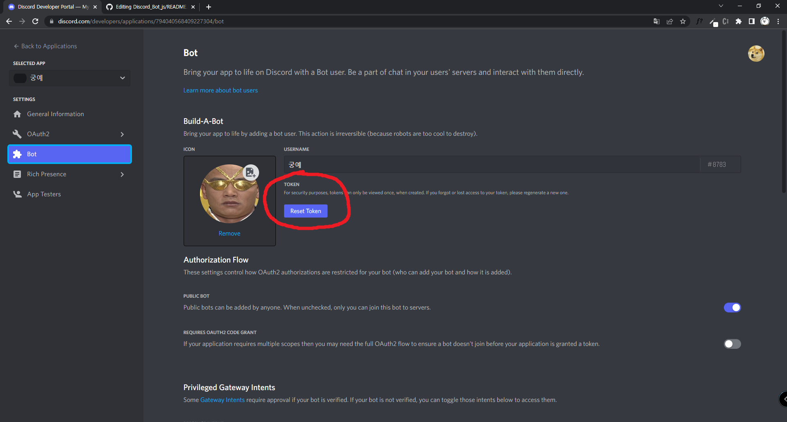
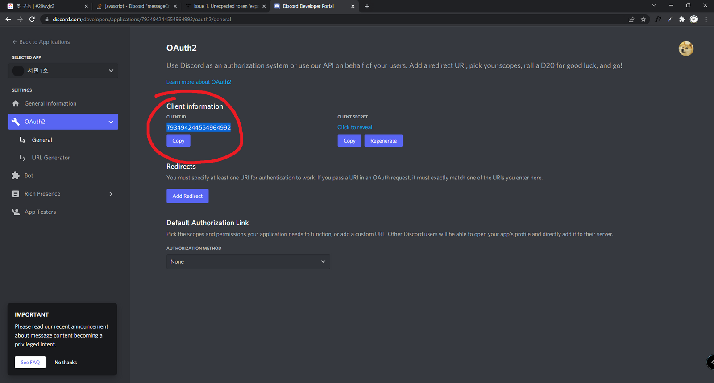
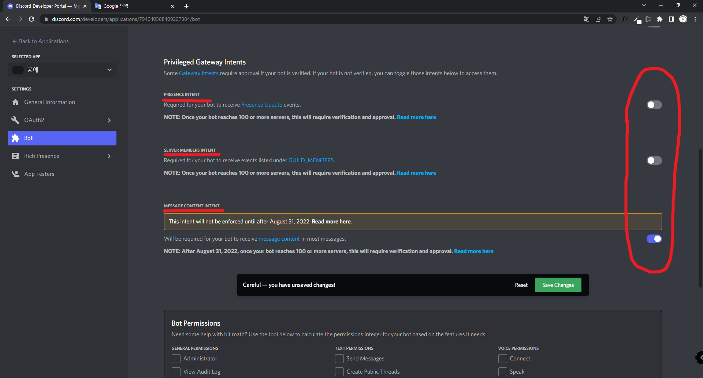

# Discord_Bot

[디스코드 봇 생성하는 곳](https://discord.com/developers/applications)

1. 위에 링크에 들어가 봇을 만들고, TOKEN을 복사해 config.py에 붙여넣기
- [MESSAGE CONTENT INTENT] 체크 필수! [참고](https://github.com/star14ms/Discord_Bot#privileged-gateway-intents)

2. 봇의 CLIENT ID를 복사해, 아래 링크 CLIENT_ID 자리에 넣어 접속하기

https://discord.com/oauth2/authorize?permissions=8&scope=bot&client_id=CLIENT_ID

3. 원하는 서버에 자신의 봇을 초대하기

4. main.py 실행하기

---

## 파일 설명

`main.py` - 실행 시 봇 가동됨

`config.py` - 실행할 봇 TOKEN 기입하는 곳

`bot_base/command.py` - 봇 명령어 설정하는 곳

`bot_base/event.py` - 봇 이벤트 설정하는 곳

`persona/__init__.py` - 봇의 페르소나 적용하는 곳

`persona/*.py` - 봇의 페르소나들

---

## 봇 생성 페이지 중요 사항들 위치

### TOKEN

### CLIENT_ID

### Privileged Gateway Intents
- 채팅을 읽으려면 MESSAGE CONTENT INTENT 체크 필요

---

## 읽기 자료

### discord.py

[Home Page]()

[Quick Start](https://discordpy.readthedocs.io/en/stable/quickstart.html)

[discord.ext.commands.Bot](https://discordpy.readthedocs.io/en/stable/ext/commands/api.html#bots)

### 명령어와 일반 메세지 처리 동시에 적용하기
[is-it-possible-to-use-on-message-and-client-command-in-the-same-code](https://stackoverflow.com/questions/62150817/is-it-possible-to-use-on-message-and-client-command-in-the-same-code)