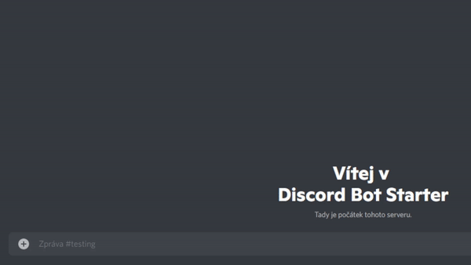

# C# Discord Bot Starter using Discord.NET

This is a template repl that allows you to easily code a Discord bot using C# and the Discord.NET library. You can use this repl as a starting point to build a full Discord bot.

In this example, I'm already assuming you have created a bot application and invited it to your server with proper permissions and scopes (`bot` and `applications.commands`).

This program takes your bot token from the secret (environment variable) called `token` - make sure you set it up before running the program, otherwise you'll receive an error!

Learn more about Discord.NET:
- https://github.com/discord-net/Discord.Net
- https://discordnet.dev/
- https://discordnet.dev/guides/introduction/intro.html
- https://discord.gg/dnet