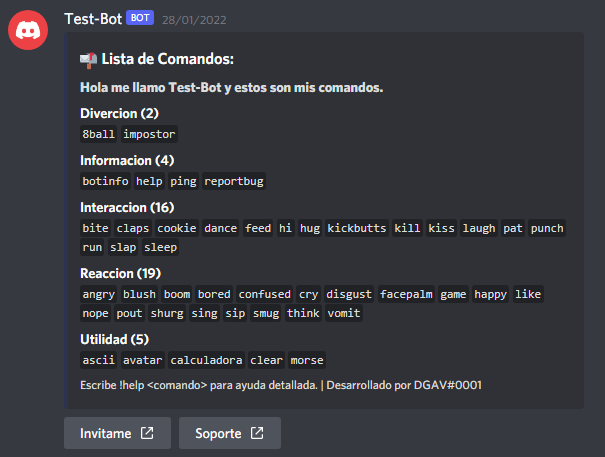

# Discord Bot
Un ejemplo de un codigo eficiente de un bot con discord v13 command handler que hice hace mucho tiempo.

# Lista de Comandos



# Edita
- Edita el Archivo config.json -> "token" -> Por el Token de tu Bot o el Bot que quieras.
- Y tambien "prefix" -> Por el Prefix que quieras que tenga.

# Instalacion

```
- npm init
- npm install
```

# Una vez tengas esto, continua con esto

```
- node index.js
```